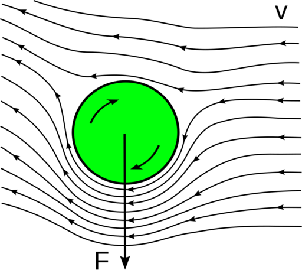
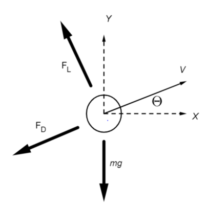

.. default-role:: math

========================
Proposal Template (22au)
========================

Basic Information
=================

My repository: <https://github.com/zurzeit/SpinBall.git>

Problem to Solve
================

As we watch the baseball game or table tennis game, we can see the spinning ball moves with a tricky trajectory. That is because the Magnus effect gives an additional force to the ball. As a result, the ball drops rapidly.

After evaluating the free body diagram of a spinning ball, there are three external force exerting on the ball, which are gravity, drag and force from the Magnus effect. And we can get the following equations

$$\\ddot{y}=-g-\\frac{F_{D}}{m}\sin (\\theta)+\\frac{F_{L}}{m}\cos (\\theta)$$

$$\\ddot{x}=-g-\\frac{F_{D}}{m}\cos (\\theta)+\\frac{F_{L}}{m}\sin (\\theta)$$

$\F_{D}$ is drag force and $F_{L}$ is Magnus effect force. Their relation with some fluid attributes are shown in below:
$$\F_{D}=\\frac{1}{2}\\rho U^2\A\C_{D}$$
$$\F_{L}=\\frac{1}{2}\\rho U^2\A\C_{L}$$
where $A$ is the cross-area of the ball, 
$\\rho$ is the fluid density, 
$U$ is the relative velocity between the ball and the fluid,
$C_{D}$ is the drag coefficient which is related to the reynolds number,
$C_{L}$ is the lift coefficient which is related to the reynolds number as well.

Hence, the problem is to solve **non-linear differential equations**. The numeric method to solve this problem will be **Runge–Kutta methods**.

API Description
===============

:math:`cal_traj(initial_states, ball_attributes, tspan)`

Given the initial states(e.g. exit angle, velocity) and the ball attributes(e.g. size), this function will return a matrix of the states over given timestamps.

:math:`viz_traj(traj)`

Given the trajectory from the outcome of the function $cal_traj$, this function will visualize the outcome of the ball trajectory.

References
==========
.. [1] Magnus effect Wiki: https://en.wikipedia.org/wiki/Magnus_effect
.. [2] Table Tennis and Physics: https://www.intechopen.com/online-first/83844
.. [3] Chapter 6 - Rotating Cylinders, Annuli, and Spheres https://www.sciencedirect.com/science/article/pii/B9780123820983000068
